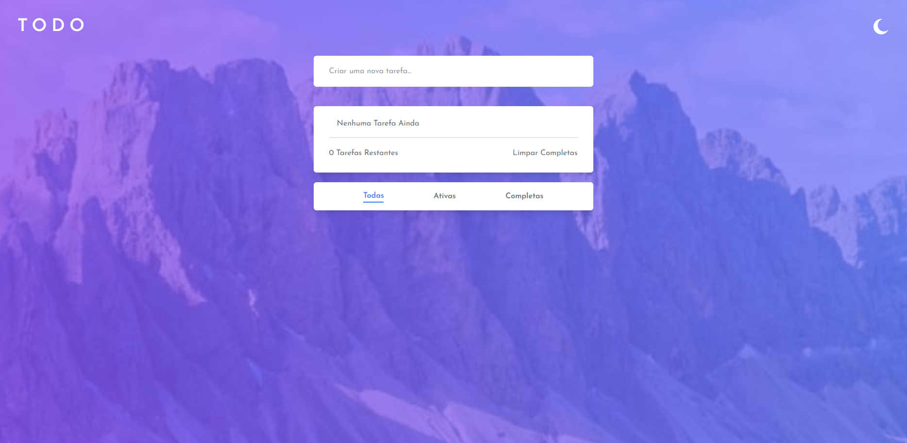
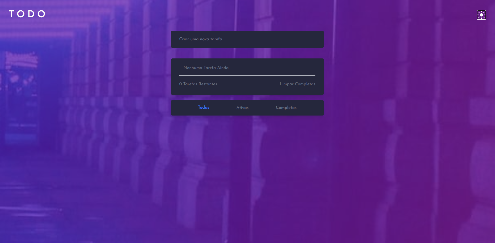

# Todo App React

Um aplicativo de lista de tarefas (ToDo List) construído com React, Tailwind CSS e Context API (para tema escuro/claro), com suporte a filtros, marcação de tarefa concluída e remoção de tarefas.

---

## 🧰 Tecnologias utilizadas

| Categoria             | Tecnologias / Ferramentas                |
| --------------------- | ---------------------------------------- |
| Front-end             | React, Vite                              |
| Styling               | Tailwind CSS                             |
| Gerenciamento de tema | Context API + localStorage               |
| Controle de estado    | Hooks (useState, useEffect)              |
| Imagens / Assets      | SVGs para ícones (check, cruz, lua, sol) |

---

## 🚀 Funcionalidades

- Adicionar tarefas digitando e pressionando Enter.
- Marcar/Desmarcar tarefas clicando no círculo ao lado da tarefa.
- Excluir tarefa individual clicando no ícone de cruz.
- Limpar todas as tarefas concluídas com botão “Limpar Completas”.
- Filtrar tarefas: Todas, Ativas, Completas.
- Tema escuro / claro com persistência — o tema é salvo no localStorage, e os backgrounds mudam conforme o tamanho da tela (mobile / desktop).
- Estilos responsivos com Tailwind e backgrounds em degradê.
- Componente reutilizáveis e estrutura modular: MainContainer, InputContainer, TaskContainer, Task, FilterContainer, ThemeContext.

---

## 📁 Organização do projeto

```
src/
├─ assets/                  # Imagens e SVGs usados no app
├─ components/              # Componentes React modulares
│   ├─ InputContainer/
│   ├─ TaskContainer/
│   ├─ Task/
│   ├─ FilterContainer/
│   └─ MainContainer/
├─ context/
│   └─ ThemeContext.jsx     # Context API para tema
├─ App.jsx
└─ main.jsx                 # ponto de entrada
tailwind.config.js          # configuração de classes customizadas
```

---

## 📸 Demonstração




---

## 📌 Como rodar localmente

1. Clone o repositório:

```bash
git clone https://github.com/endriusssantos/todo-app-react.git
cd todo-app-react
```

2. Instale as dependências:

```bash
npm install
# ou
yarn

```

3. Inicie o servidor de desenvolvimento:

```bash
npm run dev
# ou
yarn dev
```

4. Acesse no navegador em http://localhost:5173 (ou porta indicada no terminal).

---

## 🛠️ Próximas melhorias (roadmap)

- Adicionar persistência via API / backend (salvar tarefas no servidor).
- Adicionar drag-and-drop para reordenar tarefas.
- Adicionar testes unitários / integração com Jest + React Testing Library.
- Internacionalização (suporte a múltiplos idiomas).

---

## 🎯 Por que este app se destaca?

- Projeto demonstrativo de frontend moderno com React + Tailwind + Context API.
- Mostra domínio de temas escuro/claro e responsividade.
- Estrutura modular e organizada, fácil manutenção e escalabilidade.
- Preparado para extensões futuras (persistência, testes, animações).
- Excelente para apresentar em portfólio técnico para recrutadores.
